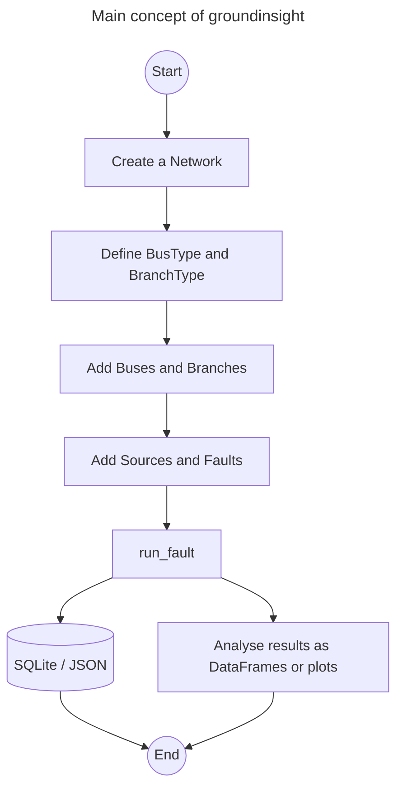

# groundinsight

**Simulation of grounding systems in electrical power grids.**

[](https://pypi.org/project/groundinsight/)
[](https://pypi.org/project/groundinsight/)
[](https://opensource.org/licenses/MIT)
[](https://ce1ectric.github.io/groundinsight/)

`groundinsight` is an open-source Python package for analysing the behaviour
of networked grounding systems during single-phase-to-ground faults. It
computes the earth-potential rise (EPR), branch (shield) currents, reduction
factors and the resulting grounding impedance at the fault location for
arbitrary bus/branch topologies including line, ring and mesh networks.

- **Documentation**: <https://ce1ectric.github.io/groundinsight/>
- **Source**: <https://github.com/Ce1ectric/groundinsight>
- **Issue tracker**: <https://github.com/Ce1ectric/groundinsight/issues>

## Why groundinsight

Medium-voltage distribution networks are meshed through shared grounding
conductors (cable shields, overhead-line earth wires, substation grounding
grids). During a single-phase-to-ground fault, the return current splits
between the local earth path at the fault location and the metallic return
path through the grounding conductors of the surrounding branches. To assess
touch-voltage safety and EMC effects, two quantities have to be known:

- the **reduction factor** $r$ describing the fraction of the fault current
  that returns through earth, and
- the **grounding impedance** $Z_G$ and the resulting EPR at the fault bus.

`groundinsight` computes both by assembling a nodal-admittance model from
user-defined frequency- and $\rho_E$-dependent impedance formulas and solving
it for every harmonic of interest.

## Features

- Pydantic v2 model layer (`Bus`, `Branch`, `Source`, `Fault`) with
  symbolic impedance formulas in `rho`, `f` and `l` evaluated through
  SymPy and cached per `BusType` / `BranchType`.
- Sparse LU solve per frequency (`scipy.sparse.linalg.splu`); mutual
  coupling injected as Norton equivalents along the source-to-fault
  path.
- Ring and mesh topologies: the phase current is determined by a solve
  on the phase-conductor network itself (`phase_current_mode="auto"`,
  the default), so a ring, a mesh or a second parallel cable no longer
  collapses onto enumerated paths. `BranchType.phase_impedance_formula`
  describes the faulted conductor; `phase_current_mode="paths"` keeps
  the older path-based scheme.
- Two reduction factors, both reported:
  `ResultReductionFactor.value` is the EPR ratio and keeps the meaning
  of the closed form `r = |1 - Z_m/Z_s|`; `value_current` is the share
  of the fault current returning through earth — the EN 50522 quantity,
  and the one that responds to the electrode at the fault bus.
- Splitting the network at the fault location (`gi.Cut`,
  `gi.analyze_cuts`): what each direction contributes, from source-free
  current division, with `1/Z_dp = 1/Z_local + Σ 1/Z_side` closing on
  the driving-point admittance.
- Parameter sweeps (`gi.run_sweep`, `gi.SweepPoint`, `gi.rho_f_points`)
  into long-format frames, with `gi.summarize` and `gi.classify` for
  statistics and user-supplied limit bands on top.
- Characterising a location without knowing its electrode
  (`gi.bus_response`): two solves determine the response for *every*
  electrode impedance. `BusResponse.extremes()` brackets the local
  quantities (`EPR_V`, `Z_driving_point_Ohm`); transfer quantities at
  other buses are not bounded by it and want `.sweep([...])`.
  `z_network` is the site-independent driving-point impedance of
  everything except the local electrode.
- Closed-form reference cases (`gi.run_reference_cases`) — six
  configurations, the ladder network among them, checked against
  results derived from first principles and run as tests.
- Outage / what-if studies via `Bus.active` / `Branch.active`,
  `gi.outage_context` and `gi.run_outage_study`.
- Inverse rho analysis (`gi.find_max_rho_scaling`,
  `gi.find_max_rho_f_scaling`) — bisect the maximum soil resistivity
  at a bus set against an EPR limit.
- Time-domain transient simulation via `gi.TransientStudy`, FFT or
  state-space ODE; the state-space path uses the lumped RLC fields
  on `BusType` and `BranchType`.
- External-network import from pandapower (`gi.from_pandapower`,
  optional extra `pip install 'groundinsight[pandapower]'`), including
  solved short-circuit cases (`gi.read_shortcircuit_results`,
  `gi.apply_shortcircuit_characteristics`) as IEC 60909 quantities.
- Conductor thermal-limit check (`gi.check_conductor_limits`): IEC 60909
  `I_th` against the IEC 60949 adiabatic limit `k·S/√t_k`, per grounding
  branch. The linear AC-RMS currents are superposed by the solve and the
  non-linear peak/thermal factors applied to that aggregate.
- SQLite persistence, JSON export/import and Polars DataFrames for
  result access; Matplotlib helpers for bar and time-series plots.
- Quiet by default; opt-in console logging via
  `gi.set_log_level("INFO")`.

See the [documentation](https://ce1ectric.github.io/groundinsight/)
for the full list and the API reference.

## Installation

`groundinsight` requires **Python 3.14 or newer** and is published on PyPI:

```bash
pip install groundinsight
```

For a local development checkout with the test suite enabled:

```bash
git clone https://github.com/Ce1ectric/groundinsight.git
cd groundinsight
poetry install
```

The documentation extras live in an optional Poetry group:

```bash
poetry install --with docs
```

See the [installation page](https://ce1ectric.github.io/groundinsight/installation/)
of the documentation for full details.

## Quickstart

```python
import groundinsight as gi

net = gi.create_network(name="QuickstartNet", frequencies=[50, 250, 350])

bus_type = gi.BusType(
    name="SubstationBus", system_type="Substation", voltage_level=20,
    impedance_formula="rho * 0.01 + j * f * 1/50 * 0.1",
)
cable_type = gi.BranchType(
    name="MSCable", grounding_conductor=True,
    self_impedance_formula="(0.25 + j * f * 0.012) * l",
    mutual_impedance_formula="(0.0  + j * f * 0.012) * l",
)

gi.create_bus(name="bus_source", type=bus_type, network=net)
gi.create_bus(name="bus_fault",  type=bus_type, network=net)
gi.create_branch(
    name="cable_1", type=cable_type,
    from_bus="bus_source", to_bus="bus_fault",
    length=5.0, network=net,
)
gi.create_source(
    name="infeed", bus="bus_source",
    values={50: 1000.0, 250: 200.0, 350: 100.0}, network=net,
)
gi.create_fault(
    name="fault1", bus="bus_fault",
    scalings={50: 1.0}, network=net,
)

gi.run_fault(network=net, fault_name="fault1")
print(net.res_all_impedances())
```

For the full walkthrough — including ring topologies with
`auto_parallel_coefficients=True`, outage / what-if studies,
transient simulations and the pandapower importer — see the
[Quickstart](https://ce1ectric.github.io/groundinsight/quickstart/)
and the [example notebooks](https://ce1ectric.github.io/groundinsight/examples/)
in the documentation.

## Model overview

All computations happen per frequency $f$ in the phasor domain:

$$
Y(f)\,\underline{u}(f) = \underline{i}(f)
\quad\Longrightarrow\quad
\underline{u}(f) = Y(f)^{-1}\,\underline{i}(f)
$$

where $Y$ is the nodal admittance matrix (bus grounding admittances on the
diagonal, branch self-admittances off-diagonal), $\underline{u}$ is the EPR
vector and $\underline{i}$ combines source currents and the Norton
equivalents of the phase-to-shield mutual coupling. The EPR-based
reduction factor at the fault bus is obtained by re-solving the same
system with all mutual Norton sources removed and taking the ratio
$|u_{\text{fault}}^{\text{with}}|/|u_{\text{fault}}^{\text{without}}|$.
Because both solves share the same $Y$, that quotient is structurally
insensitive to the electrode *at* the fault bus; the current-based
factor $|I_E|/|3I_0|$ is reported alongside it and does respond, which
is the one to use for sensitivity work and the one EN 50522 means.

For the full model — objects, path finding, reduction factor and grounding
impedance — see the [Concepts](https://ce1ectric.github.io/groundinsight/concepts/)
page of the documentation.

## Workflow



## Development

```bash
# run the test suite with coverage
poetry run pytest --cov=groundinsight

# format the code with black
poetry run black src tests scripts

# build the docs locally
poetry install --with docs
poetry run mkdocs serve
```

A release is cut via the built-in Poetry script, which bumps the version in
`pyproject.toml`, `src/groundinsight/__init__.py` and `CITATION.cff`, creates
an annotated tag and pushes the commit plus the tag. The GitHub Actions
release workflow then takes over, builds sdist and wheel and publishes to
PyPI via OIDC Trusted Publishing.

```bash
poetry run release patch
poetry run release minor
poetry run release major
poetry run release set 1.2.3
```

## Citation

If you use `groundinsight` for scientific work, please cite it using the
`CITATION.cff` metadata shipped with this repository.

## Contributing

Pull requests are welcome. For major changes, please open an issue first to
discuss what you would like to change. New code should come with tests;
please run the full suite and check that coverage does not regress.

## License

`groundinsight` is released under the [MIT License](LICENSE).
