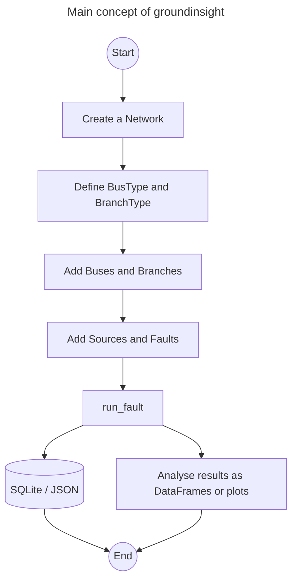

# groundinsight

**Simulation of grounding systems in electrical power grids.**

[](https://pypi.org/project/groundinsight/)
[](https://pypi.org/project/groundinsight/)
[](https://opensource.org/licenses/MIT)
[](https://ce1ectric.github.io/groundinsight/)

`groundinsight` is an open-source Python package for analysing the behaviour
of networked grounding systems during single-phase-to-ground faults. It
computes the earth-potential rise (EPR), branch (shield) currents, reduction
factors and the resulting grounding impedance at the fault location for
arbitrary bus/branch topologies including line, ring and mesh networks.

- **Documentation**: <https://ce1ectric.github.io/groundinsight/>
- **Source**: <https://github.com/Ce1ectric/groundinsight>
- **Issue tracker**: <https://github.com/Ce1ectric/groundinsight/issues>

## Why groundinsight

Medium-voltage distribution networks are meshed through shared grounding
conductors (cable shields, overhead-line earth wires, substation grounding
grids). During a single-phase-to-ground fault, the return current splits
between the local earth path at the fault location and the metallic return
path through the grounding conductors of the surrounding branches. To assess
touch-voltage safety and EMC effects, two quantities have to be known:

- the **reduction factor** $r$ describing the fraction of the fault current
  that returns through earth, and
- the **grounding impedance** $Z_G$ and the resulting EPR at the fault bus.

`groundinsight` computes both by assembling a nodal-admittance model from
user-defined frequency- and $\rho_E$-dependent impedance formulas and solving
it for every harmonic of interest.

## Features

- Bus, branch, source and fault objects modelled as Pydantic v2 classes.
- Symbolic impedance formulas in `rho`, `f` and `l`, evaluated through
  SymPy. Compiled callables are cached per `BusType` / `BranchType` and
  evaluated vectorised over all frequencies, so building large networks
  scales cheaply with the number of buses and branches.
- Sparse LU solver per frequency (`scipy.sparse.linalg.splu`).
- Mutual coupling between faulted phase and grounding conductor treated as
  Norton equivalents along the path from source to fault.
- Reduction factor computed from the ratio of EPR with and without mutual
  coupling at the fault bus.
- Support for **ring and mesh** grounding topologies with multiple parallel
  paths; the optional `auto_parallel_coefficients=True` flag on
  `run_fault` derives the per-path current share from a reduced phase-only
  solve.
- SQLite persistence and JSON export/import of networks and type libraries.
- Polars DataFrames for result access (`net.res_buses(...)`,
  `net.res_branches(...)`, `net.res_all_impedances()`).
- Matplotlib helpers for bar plots of EPR, branch currents and bus currents.
- **Roadmap (0.4.0)**: import grids from `pandapower` and PowerFactory
  (`.dgs` export and live Python API) so existing distribution-network
  models can be reused as the topology source — see
  [`CHANGELOG.md`](CHANGELOG.md) for the planned schema.

## Installation

`groundinsight` requires **Python 3.12 or newer** and is published on PyPI:

```bash
pip install groundinsight
```

For a local development checkout with the test suite enabled:

```bash
git clone https://github.com/Ce1ectric/groundinsight.git
cd groundinsight
poetry install
```

The documentation extras live in an optional Poetry group:

```bash
poetry install --with docs
```

See the [installation page](https://ce1ectric.github.io/groundinsight/installation/)
of the documentation for full details.

## Quickstart

```python
import groundinsight as gi

net = gi.create_network(name="QuickstartNet", frequencies=[50, 250, 350])

bus_type = gi.BusType(
    name="SubstationBus",
    description="Lumped substation grounding grid",
    system_type="Substation",
    voltage_level=20,
    impedance_formula="rho * 0.01 + j * f * 1/50 * 0.1",
)

cable_type = gi.BranchType(
    name="MSCable",
    description="20 kV single-core cable with shield",
    grounding_conductor=True,
    self_impedance_formula="(0.25 + j * f * 0.012) * l",
    mutual_impedance_formula="(0.0  + j * f * 0.012) * l",
)

gi.create_bus(name="bus_source", type=bus_type, network=net, specific_earth_resistance=100.0)
gi.create_bus(name="bus_fault",  type=bus_type, network=net, specific_earth_resistance=100.0)

gi.create_branch(
    name="cable_1", type=cable_type,
    from_bus="bus_source", to_bus="bus_fault",
    length=5.0, specific_earth_resistance=100.0, network=net,
)

gi.create_source(
    name="infeed", bus="bus_source",
    values={50: 1000.0, 250: 200.0, 350: 100.0}, network=net,
)
gi.create_fault(
    name="fault1", bus="bus_fault",
    description="single-phase-to-ground fault",
    scalings={50: 1.0}, network=net,
)

gi.run_fault(network=net, fault_name="fault1")

print(net.res_all_impedances())
```

For a ring/meshed network, enable the automatic parallel-path distribution:

```python
gi.run_fault(
    network=net,
    fault_name="fault1",
    auto_parallel_coefficients=True,
)
```

More worked examples — including the CIRED reference and a low-voltage
network — are available as notebooks in the
[documentation](https://ce1ectric.github.io/groundinsight/examples/).

## Model overview

All computations happen per frequency $f$ in the phasor domain:

$$
Y(f)\,\underline{u}(f) = \underline{i}(f)
\quad\Longrightarrow\quad
\underline{u}(f) = Y(f)^{-1}\,\underline{i}(f)
$$

where $Y$ is the nodal admittance matrix (bus grounding admittances on the
diagonal, branch self-admittances off-diagonal), $\underline{u}$ is the EPR
vector and $\underline{i}$ combines source currents and the Norton
equivalents of the phase-to-shield mutual coupling. The reduction factor at
the fault bus is obtained by re-solving the same system with all mutual
Norton sources removed and taking the ratio
$|u_{\text{fault}}^{\text{with}}|/|u_{\text{fault}}^{\text{without}}|$.

For the full model — objects, path finding, reduction factor and grounding
impedance — see the [Concepts](https://ce1ectric.github.io/groundinsight/concepts/)
page of the documentation.

## Workflow



## Development

```bash
# run the test suite with coverage
poetry run pytest --cov=groundinsight

# format the code with black
poetry run black src tests scripts

# build the docs locally
poetry install --with docs
poetry run mkdocs serve
```

A release is cut via the built-in Poetry script, which bumps the version in
`pyproject.toml`, `src/groundinsight/__init__.py` and `CITATION.cff`, creates
an annotated tag and pushes the commit plus the tag. The GitHub Actions
release workflow then takes over, builds sdist and wheel and publishes to
PyPI via OIDC Trusted Publishing.

```bash
poetry run release patch
poetry run release minor
poetry run release major
poetry run release set 1.2.3
```

## Citation

If you use `groundinsight` for scientific work, please cite it using the
`CITATION.cff` metadata shipped with this repository.

## Contributing

Pull requests are welcome. For major changes, please open an issue first to
discuss what you would like to change. New code should come with tests;
please run the full suite and check that coverage does not regress.

## License

`groundinsight` is released under the [MIT License](LICENSE).
